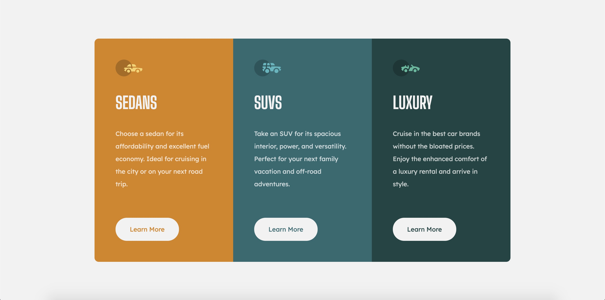

# Frontend Mentor - 3-column preview card component solution

This is a solution to the [3-column preview card component challenge on Frontend Mentor](https://www.frontendmentor.io/challenges/3column-preview-card-component-pH92eAR2-). Frontend Mentor challenges help you improve your coding skills by building realistic projects.

## Table of contents

- [Overview](#overview)
  - [The challenge](#the-challenge)
  - [Screenshot](#screenshot)
  - [Links](#links)
- [My process](#my-process)
  - [Built with](#built-with)
  - [What I learned](#what-i-learned)
- [Author](#author)

## Overview

### The challenge

Users should be able to:

- View the optimal layout depending on their device's screen size
- See hover states for interactive elements

### Screenshot

### Links

- Solution URL: [https://www.frontendmentor.io/solutions/html-css-flexbox-8iRaelc9V](https://www.frontendmentor.io/solutions/html-css-flexbox-8iRaelc9V)
- Live Site URL: [https://therealmichaellai.github.io/3-column-preview-card-component-main/](https://therealmichaellai.github.io/3-column-preview-card-component-main/)

## My process

### Built with

- Semantic HTML5 markup
- CSS custom properties
- Flexbox
- Mobile-first workflow

### What I learned

This exercise was much smoother than the previous "stats preview card". I felt the code was much more organized and my approach was more systematic. There was much less media query specific code and more code shared between each view.

## Author

- Frontend Mentor - [@therealmichaellai](https://www.frontendmentor.io/profile/therealmichaellai)
